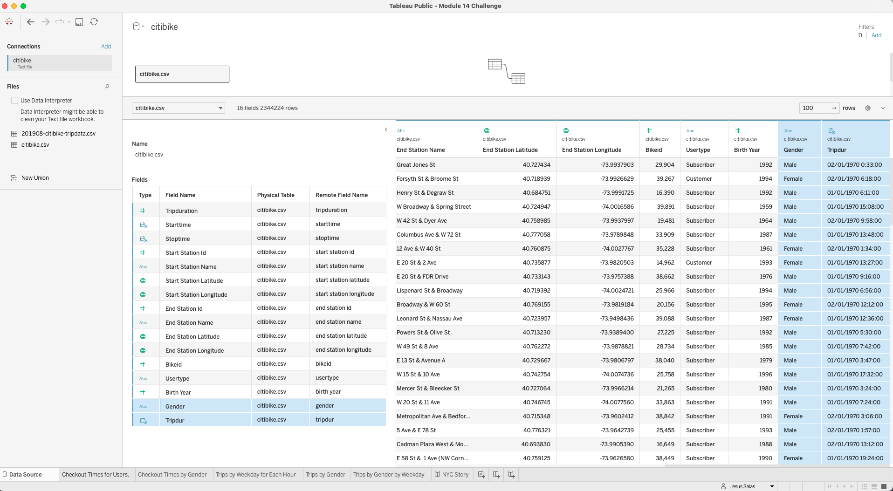
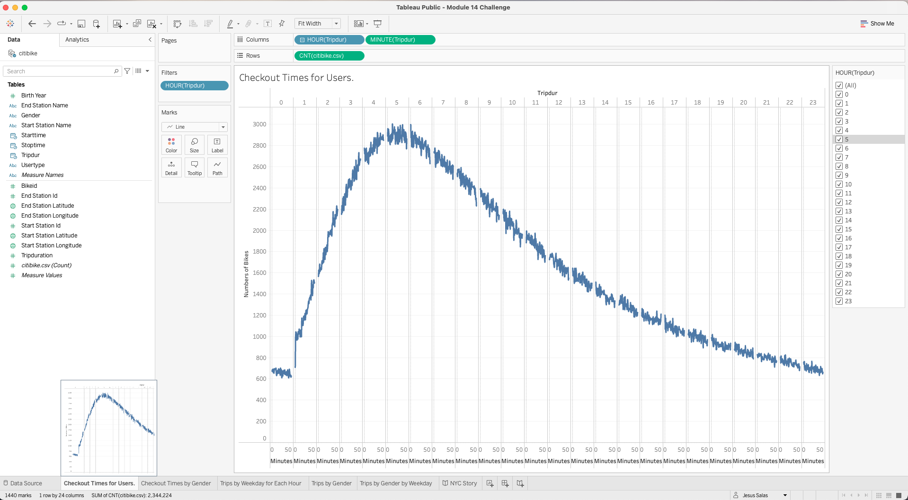
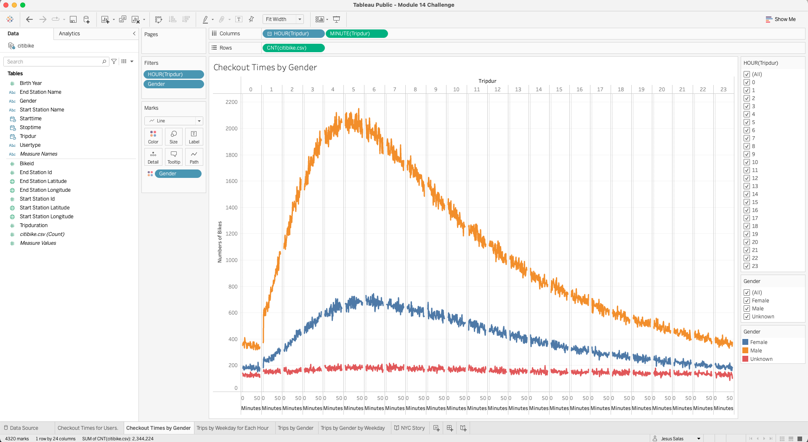
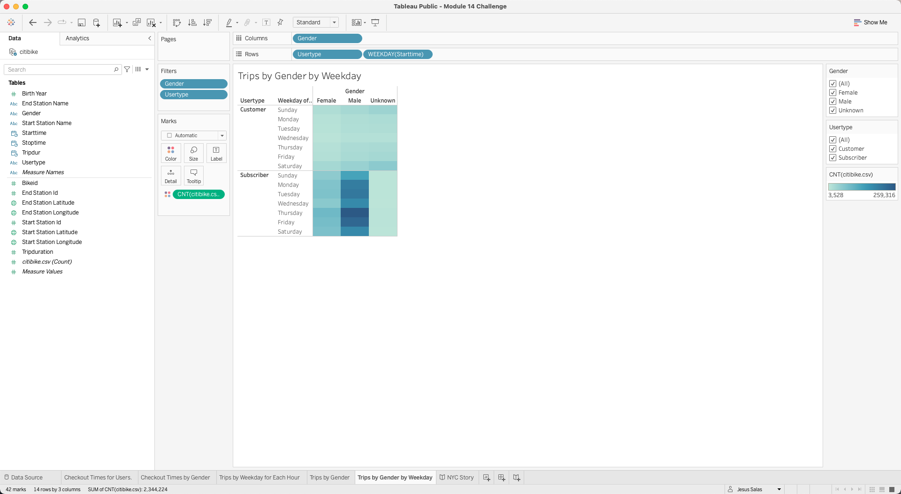
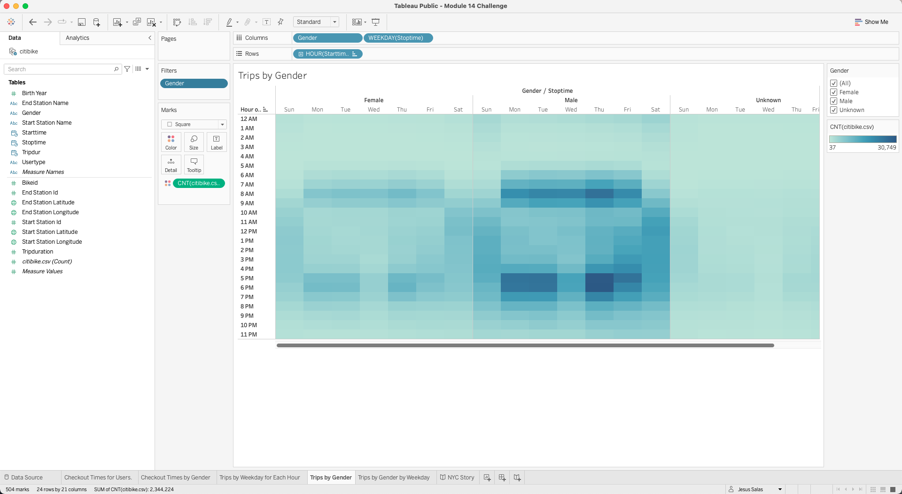
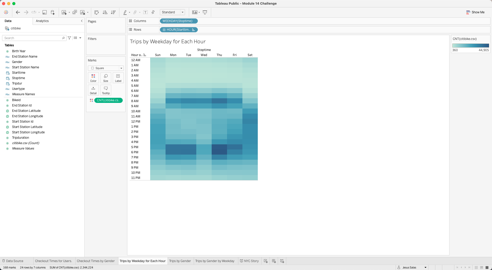
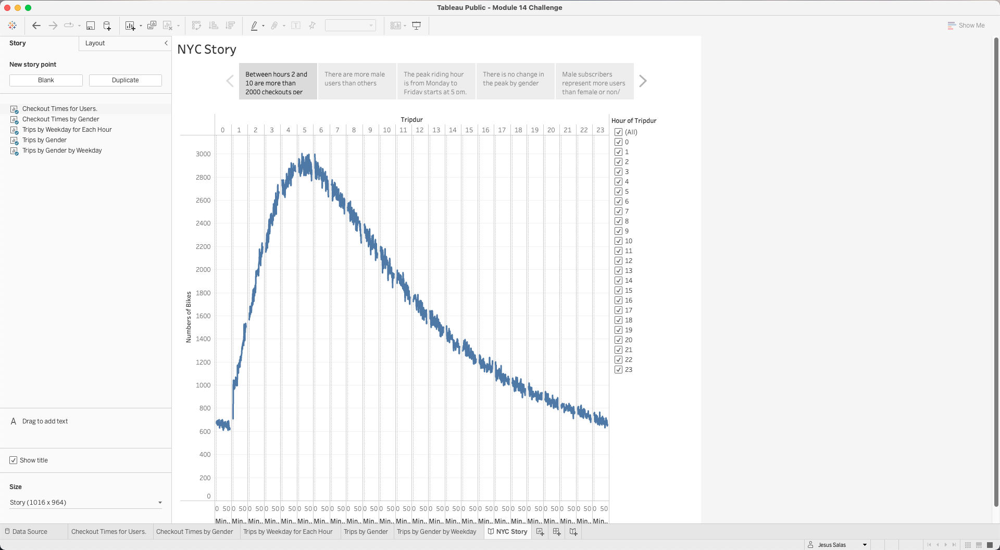
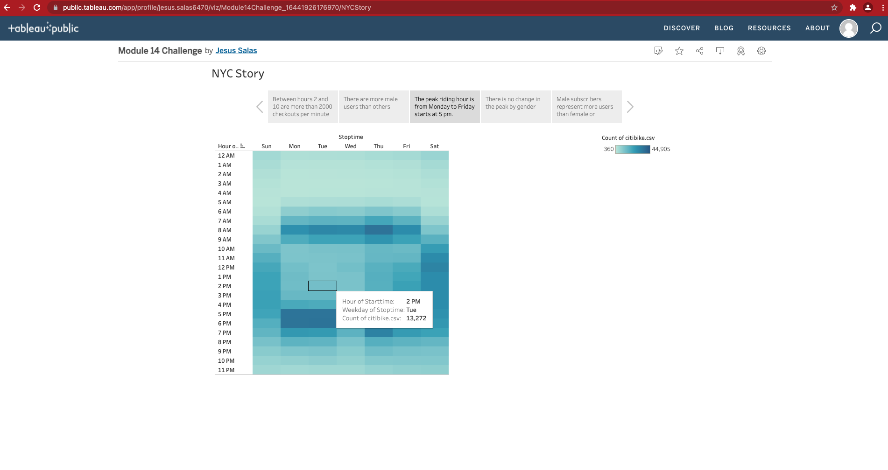

# bikesharing

In this project, we analyze using tableau to visualize the information 

Link to our Tablue Story 

https://public.tableau.com/app/profile/jesus.salas6470/viz/Module14Challenge_16441926176970/NYCStory
